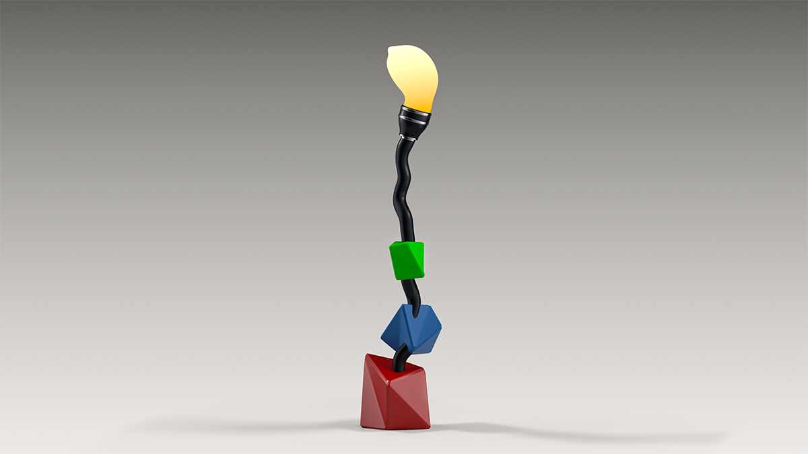

# Model a prop in Autodesk Maya



### Assignment Brief:
In this assignment, you are a product designer for the premiere mega lamp company, Schmapple Lights Company. Schmapple Lights Company has asked its designers to produce never-before seen concept lamps. You're design objective is to design a concept lamp using polygonal modeling techniques and to render a concept image using RenderMan. You will produce at least one image that shows your design in the best light.

### Learning resources
- Polygonal Modeling: [Maya 2016 Essential Training](https://www.lynda.com/Maya-tutorials/Differences-between-NURBS-polygons/370380/413208-4.html)
- RenderMan: [Getting started with RenderMan for Maya](https://www.lynda.com/Renderman-tutorials/Welcome/442861/461592-4.html)

### Steps to completion
1. Download the project folder: [USERID-renderman-proj.zip](https://github.com/michael-collins/3d-learning-materials/blob/master/downloads/USERID-renderman-proj.zip?raw=true)
2. Rename the project folder to include your user id.
3. In the scenes folder, locate the file called ```USERID-renderman_project.ma``` and replace 'USERID' with your user id.
4. Double-click on the scene file to open Maya. Go to **File** -> **Set project**. Choose the project folder you just renamed in step 2.
5. In the project file, you will see an example polygon model with RenderMan materials applied. If you do not have the RenderMan shelf available in the interface, go to **Windows** -> **Settings/Preferences** -> **Plug-in Manager**. Scroll down and check ***load*** for ```RenderMan_for_Maya.bundle```.
6. **ENABLE AUTOSAVE.** Go to **Maya** -> **Preferences** -> **Files/Projects** and check ***enable***. If you choose not to do this, you will undoubtedly lose work from frequent software crashes.
7. When ready, delete the example model in the scene and start modeling your own design.
  - Note: It helps to sketch your idea on paper before you go into the modeling process.
  - If you have little familiarity with polygonal modeling, please see the [Maya 2016 Essential Training](https://www.lynda.com/Maya-tutorials/Differences-between-NURBS-polygons/370380/413208-4.html) learning resources above. 
8. **Scene requirements:**
  - RenderMan lights (you can use the existing ones in the scene or create your own)
  - At least two RenderMan materials (they can be of the same type) must be applied to your model in the scene. The **PxrDisney** material is a good starting point.
  - The final rendered image must be at 1080HD resolution or higher. Please don't not render above 4k resolution for this assignment.
  - To reduce graininess of the final render, the Min. Samples in the Sampling tab under RenderMan Controls should be set to 32 or higher. Max. samples can be left as default 512.
  - If you get stuck, please see the [Getting started with RenderMan for Maya](https://www.lynda.com/Renderman-tutorials/Welcome/442861/461592-4.html) learning resources linked above for in-depth instructions on fine-tuning renders.
9. **Optional:** Composite and color-grade your render with a custom background in Photoshop.

### Deliverables
1. Upload a single openEXR image called  ```USERID-lamp-render.exr``` to Canvas.